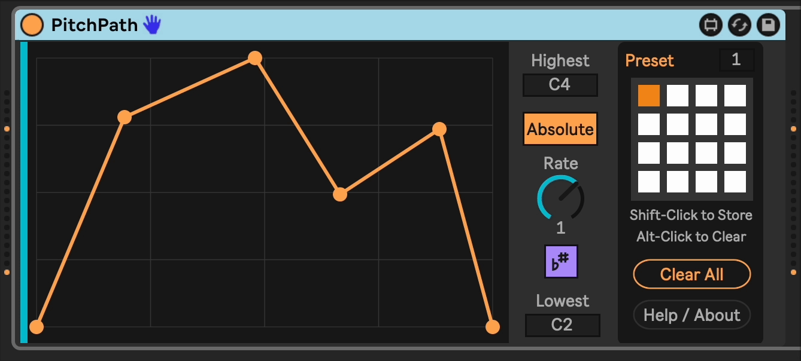

# PitchPath

PitchPath is a sequencer that you program by drawing a line or curve.

You specify the time duration the line represents, as well as the lowest and highest notes (absolute or relative).

Send it a MIDI note, and LineSeq will transform or output a note according to where the line is at that moment, optionally with scale awareness.

## Installation

[Download the newest .amxd file from the latest release](https://github.com/zsteinkamp/m4l-PitchPath/releaes) or clone this repository, and drag the `PitchPath.amxd` device into a track in Ableton Live.

## Changelog

* 2025-01-12 [v1](https://github.com/zsteinkamp/m4l-PitchPath/) - Initial release.

## Usage

### Setup
* Use the `Highest` and `Lowest` textboxes to set your output note range.
* Choose `Absolute` or `Relative` pitch mode.
  * `Absolute` mode will ignore the pitch of the incoming note, and only output notes in the range you specify.
  * `Relative` mode will adjust the pitch of the incoming note within the constraints of the `Highest` and `Lowest` values.
* Select a time interval that the graph represents.
* Enable or disable `Scale Awareness`

### Usage
* Send notes to PitchPath with MIDI notes, an arpeggiator, or another device like [LenStepper](https://plugins.steinkamp.us/m4l-LenStepper).

## TODO

* Non-note time values (?)

## Contributing

I'd love it if others extended this device. If you would like to contribute, simply fork this repo, make your changes, and open a pull request and I'll have a look.
